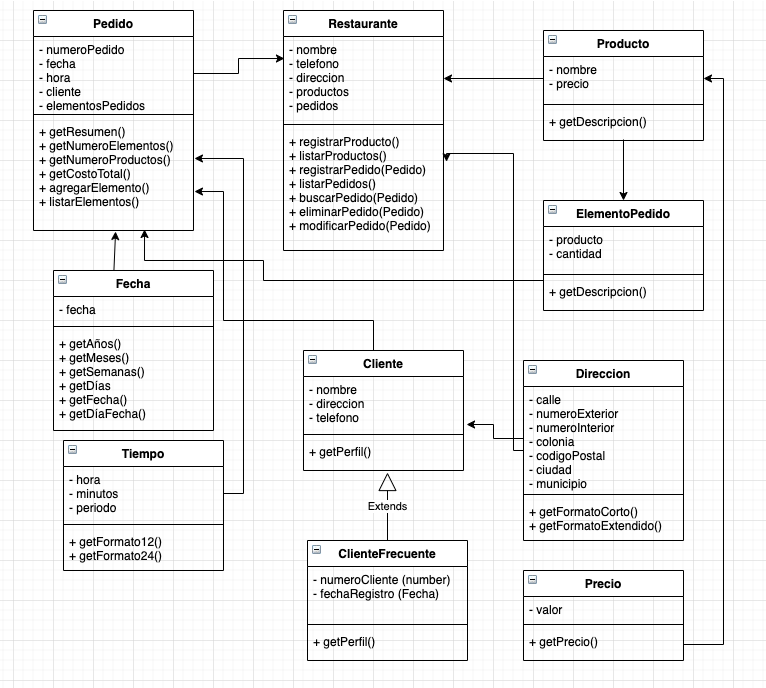

# Encapsulación y Herencia

## El Restaurante

Se requiere desarrollar un sistema web que permita administrar los pedidos de un restaurante. Para este sistema se ha diseñado la siguiente arquitectura la cual deberás implementar utilizando JavaScript

## Descripción de clases
La mayoría de los detalles de las clases para su implementación se pueden obtener del diagrama UML. Sin embargo a continuación se presentan algunas precisiones para algunos métodos o atributos de las clases.

## Requisitos

- Todas las clases deberán estár encapsuladas
- Sólo se proveerán los métodos de acceso (lectura y/o escritura) que se requieran

Esta tarea es continuación de la tarea 01 Conceptos básicos, por lo que se puede utilizar ese código como base y realizar los ajustes necesarios para que se cumpla con los nuevos requerimientos.

## La clase Fecha

- Debe estar encapsulada

## La clase Tiempo

- Debe estar encapsulada

## La clase Direccion

- Debe estar encapsulada

## La clase Precio

- Debe estar encapsulada

## La clase Producto

- Debe estar encapsulada

## La clase ElementoPedido

- Debe estar encapsulada

## La clase Pedido

- Debe estar encapsulada
- El constructor debe recibir los parámetros mediante un objeto
  
- Atributos
  - numeroPedido. El número que identifica al pedido
  
## La clase Restaurante

- Debe estar encapsulada
- El constructor debe recibir los parámetros mediante un objeto
  
- Métodos
  - registrarPedido(Pedido). Registra un nuevo Pedido, pero debe asegurarse que el Pedido no esté registrado previamente, es decir un Pedido no puede registrarse dos veces. Si el Pedido se registra de manera exitosa, entonces el método regresará el valor true. Si no se pudo registrar, regresará false. Para determinar si un Pedido ya está registrado se debe revisar el número de pedido.
  - buscarPedido(Pedido). Busca un Pedido registrado en el Restaurante, si encuentra al Pedido el método regresa el objeto del Pedido encontrado. Si no lo encuentra el método regresará null.
  - eliminarPedido(Pedido). Busca el Pedido en el registro del Restaurante y si lo elimina el método regresa true, si no lo elimina por que no lo encontró, regresa false.
  - actualizarPedido(Pedido). Actualiza el registro de un Pedido, si la actualización se realiza de manera exitosa, el método regresa true, si no se pudo realizar, el método regresa false.

## La clase ClienteFrecuente

Esta clase es una especialización (Hereda) de la clase Cliente

- Debe estar encapsulada
- El constructor debe recibir los parámetros mediante un objeto

- Atributos
  - numeroCliente(number). El número de registro del cliente
  - fechaRegistro(Fecha). La fecha en la que se registró el cliente

- Métodos
  - getPerfil(). Regresa un string con el número de cliente, fecha de registro, nombre, dirección y teléfono. Por ejemplo:
    - 1234, 5/May/2000, Juan Perez Díaz, Av, Universidad 333, 3123161075
